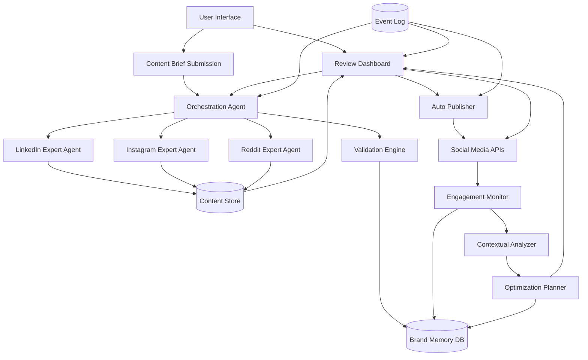
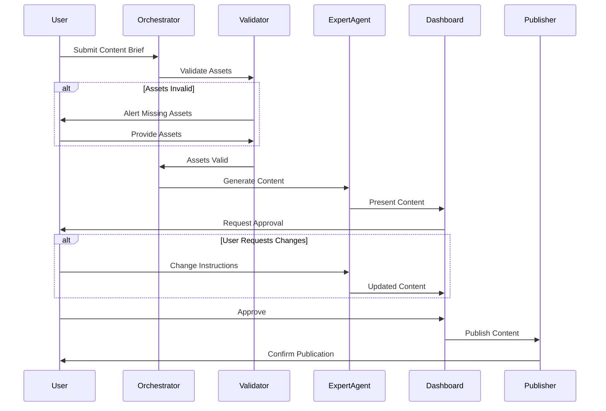

# Design Document: AI Marketing Ecosystem

## Overview

The AI Marketing Ecosystem is a multi-agent system that orchestrates the complete lifecycle of digital marketing content. The architecture follows an event-driven, human-in-the-loop pattern where autonomous agents handle content generation, validation, publishing, and optimization while requiring explicit human approval at critical decision points.

The system is built around five core subsystems:
1. **Orchestration Layer**: Master coordinator managing workflow state and agent communication
2. **Content Generation Layer**: Platform-specific expert agents that create tailored content
3. **Validation and Publishing Layer**: Asset verification and automated deployment
4. **Monitoring and Analysis Layer**: Engagement tracking and sentiment analysis
5. **Learning and Memory Layer**: Persistent brand knowledge and performance patterns

## Architecture

### System Architecture Diagram



### Agent Communication Pattern

The system uses an event-driven architecture where agents communicate through a central message bus:



## Components and Interfaces

### 1. Orchestration Agent

**Responsibility**: Coordinates workflow execution, manages agent lifecycle, and maintains campaign state.

**Interface**:
```typescript
interface OrchestrationAgent {
  // Campaign management
  startCampaign(brief: ContentBrief, platforms: Platform[]): CampaignId
  getCampaignStatus(campaignId: CampaignId): CampaignStatus
  pauseCampaign(campaignId: CampaignId): void
  resumeCampaign(campaignId: CampaignId): void
  
  // Agent coordination
  dispatchToExpertAgent(platform: Platform, brief: ContentBrief): TaskId
  aggregateResults(taskIds: TaskId[]): ContentCollection
  
  // Error handling
  handleAgentFailure(agentId: AgentId, error: Error): RecoveryAction
}

type CampaignStatus = {
  campaignId: CampaignId
  phase: 'validation' | 'generation' | 'review' | 'publishing' | 'monitoring' | 'complete'
  platformStatuses: Map<Platform, PlatformStatus>
  errors: Error[]
  createdAt: Timestamp
  updatedAt: Timestamp
}
```

**Implementation Notes**:
- Uses state machine pattern to track campaign progression
- Implements retry logic with exponential backoff for agent failures
- Maintains event log for all state transitions
- Supports parallel execution of platform-specific agents

### 2. Validation Engine

**Responsibility**: Verifies brand assets are present, correctly formatted, and accessible before content generation.

**Interface**:
```typescript
interface ValidationEngine {
  validateAssets(brandContext: BrandContext): ValidationResult
  checkAssetAvailability(assetUrl: string): boolean
  validateImageDimensions(image: Asset, requirements: DimensionRequirements): boolean
  validateLinkAccessibility(link: string): boolean
}

type ValidationResult = {
  isValid: boolean
  missingAssets: Asset[]
  invalidAssets: Array<{asset: Asset, reason: string}>
  warnings: string[]
}

type Asset = {
  type: 'logo' | 'image' | 'video' | 'link' | 'hashtag'
  identifier: string
  url?: string
  metadata: Record<string, any>
}
```

**Validation Rules**:
- Logos: Must be accessible, valid image format (PNG, JPG, SVG), minimum resolution 200x200px
- Links: Must return HTTP 200 status, must not be broken or redirect to error pages
- Images: Must meet platform-specific dimension requirements
- Videos: Must meet platform-specific duration and size limits
- Hashtags: Must follow platform-specific formatting rules

### 3. Expert Agents (Platform-Specific)

**Responsibility**: Generate platform-optimized content using brand context and performance history.

**Base Interface**:
```typescript
interface ExpertAgent {
  platform: Platform
  
  generateContent(brief: ContentBrief, brandContext: BrandContext): GeneratedContent
  regenerateWithFeedback(contentId: ContentId, feedback: string): GeneratedContent
  adaptTone(content: string, targetTone: Tone): string
  
  // Platform-specific optimization
  optimizeForPlatform(content: GeneratedContent): GeneratedContent
}

type GeneratedContent = {
  contentId: ContentId
  platform: Platform
  text: string
  media: Asset[]
  hashtags: string[]
  metadata: {
    characterCount: number
    estimatedReach: number
    suggestedPostTime: Timestamp
  }
  version: number
  generatedAt: Timestamp
}
```

**Platform-Specific Implementations**:

**LinkedIn Agent**:
- Optimizes for professional tone and thought leadership
- Emphasizes industry insights and business value
- Recommends optimal post length (1200-1500 characters)
- Suggests professional hashtags and mentions

**Instagram Agent**:
- Optimizes for visual storytelling and emotional engagement
- Emphasizes aesthetic appeal and brand personality
- Recommends image aspect ratios (1:1, 4:5, 9:16)
- Suggests trending hashtags and emoji usage

**Reddit Agent**:
- Optimizes for community-specific tone and authenticity
- Emphasizes value-first, non-promotional approach
- Adapts language to subreddit culture
- Avoids corporate speak and overt marketing

### 4. Review Dashboard

**Responsibility**: Provides human interface for content approval, rejection, and change requests.

**Interface**:
```typescript
interface ReviewDashboard {
  // Content review
  getPendingContent(campaignId: CampaignId): GeneratedContent[]
  approveContent(contentId: ContentId, userId: UserId): ApprovalRecord
  rejectContent(contentId: ContentId, userId: UserId, reason: string): void
  requestChanges(contentId: ContentId, userId: UserId, instructions: string): void
  
  // Optimization review
  getPendingOptimizations(campaignId: CampaignId): OptimizationProposal[]
  approveOptimization(proposalId: ProposalId, userId: UserId): void
  rejectOptimization(proposalId: ProposalId, userId: UserId): void
  
  // Audit trail
  getApprovalHistory(campaignId: CampaignId): ApprovalRecord[]
}

type ApprovalRecord = {
  contentId: ContentId
  userId: UserId
  action: 'approve' | 'reject' | 'request_changes'
  timestamp: Timestamp
  notes?: string
}
```

**UI Components**:
- Side-by-side content comparison for multi-platform campaigns
- Inline editing for minor adjustments
- Version history viewer
- Approval workflow with single-click actions
- Real-time collaboration for team reviews

### 5. Auto Publisher

**Responsibility**: Publishes approved content to social media platforms via their APIs.

**Interface**:
```typescript
interface AutoPublisher {
  publish(content: GeneratedContent, credentials: PlatformCredentials): PublicationResult
  schedulePublication(content: GeneratedContent, publishAt: Timestamp): ScheduledPublication
  updatePublishedContent(postId: PostId, updates: ContentUpdate): UpdateResult
  deletePublishedContent(postId: PostId): void
  
  // Status checking
  getPublicationStatus(postId: PostId): PublicationStatus
}

type PublicationResult = {
  success: boolean
  postId?: PostId
  platformUrl?: string
  error?: Error
  publishedAt: Timestamp
}

type ContentUpdate = {
  text?: string
  media?: Asset[]
  hashtags?: string[]
}
```

**Platform Integration**:
- LinkedIn API: Uses OAuth 2.0, posts via UGC Post API
- Instagram API: Uses Instagram Graph API, requires Facebook Business account
- Reddit API: Uses OAuth 2.0, posts via Submit API

**Error Handling**:
- Rate limiting: Implements exponential backoff and retry queues
- Authentication failures: Alerts user to refresh credentials
- Content policy violations: Captures platform error messages and presents to user
- Network failures: Queues for retry with configurable attempts

### 6. Engagement Monitor

**Responsibility**: Tracks post-publication engagement metrics and sentiment signals.

**Interface**:
```typescript
interface EngagementMonitor {
  startMonitoring(postId: PostId, duration: Duration): MonitoringSession
  stopMonitoring(sessionId: SessionId): EngagementData
  
  collectMetrics(postId: PostId): EngagementMetrics
  analyzeComments(postId: PostId): CommentAnalysis[]
  
  // Real-time alerts
  onNegativeSentiment(callback: (alert: SentimentAlert) => void): void
  onViralGrowth(callback: (alert: ViralAlert) => void): void
}

type EngagementMetrics = {
  postId: PostId
  likes: number
  comments: number
  shares: number
  reach: number
  impressions: number
  clickThroughRate: number
  engagementRate: number
  collectedAt: Timestamp
}

type CommentAnalysis = {
  commentId: CommentId
  text: string
  sentiment: 'positive' | 'negative' | 'neutral'
  sentimentScore: number // -1.0 to 1.0
  topics: string[]
  requiresResponse: boolean
}
```

**Monitoring Strategy**:
- Primary observation window: 48 hours post-publication
- Extended monitoring: Continues at reduced frequency for 30 days
- Polling intervals: Every 15 minutes for first 48 hours, hourly thereafter
- Sentiment analysis: Uses NLP model to classify comment sentiment
- Anomaly detection: Identifies unusual engagement patterns (viral growth, negative sentiment spikes)

### 7. Contextual Analyzer

**Responsibility**: Analyzes engagement data to identify patterns, trends, and optimization opportunities.

**Interface**:
```typescript
interface ContextualAnalyzer {
  analyzeEngagement(postId: PostId, engagementData: EngagementData): AnalysisReport
  compareToBenchmark(postId: PostId, historicalData: HistoricalPerformance): ComparisonReport
  identifyTrends(campaignId: CampaignId): TrendReport
  
  // Sentiment analysis
  aggregateSentiment(comments: CommentAnalysis[]): SentimentSummary
  detectSentimentShift(postId: PostId, timeWindow: Duration): SentimentTrend
}

type AnalysisReport = {
  postId: PostId
  overallPerformance: 'excellent' | 'good' | 'average' | 'poor'
  strengths: string[]
  weaknesses: string[]
  recommendations: string[]
  sentimentSummary: SentimentSummary
}

type SentimentSummary = {
  overallSentiment: 'positive' | 'negative' | 'neutral' | 'mixed'
  positivePercentage: number
  negativePercentage: number
  neutralPercentage: number
  dominantTopics: string[]
  concerningComments: CommentAnalysis[]
}
```

**Analysis Techniques**:
- Time-series analysis for engagement velocity
- Comparative analysis against historical performance
- Sentiment trend detection using moving averages
- Topic modeling to identify discussion themes
- Outlier detection for unusual engagement patterns

### 8. Optimization Planner

**Responsibility**: Determines when and how to optimize content based on analysis results.

**Interface**:
```typescript
interface OptimizationPlanner {
  evaluateOptimizationNeed(analysisReport: AnalysisReport): OptimizationDecision
  generateOptimizationProposal(postId: PostId, decision: OptimizationDecision): OptimizationProposal
  
  // Strategy selection
  selectOptimizationStrategy(context: OptimizationContext): OptimizationStrategy
  draftContentUpdate(postId: PostId, strategy: OptimizationStrategy): ContentUpdate
}

type OptimizationDecision = {
  shouldOptimize: boolean
  urgency: 'immediate' | 'soon' | 'monitor'
  reasons: string[]
  targetMetrics: string[]
}

type OptimizationProposal = {
  proposalId: ProposalId
  postId: PostId
  strategy: OptimizationStrategy
  proposedChanges: ContentUpdate
  expectedImpact: string
  rationale: string
  createdAt: Timestamp
}

type OptimizationStrategy = 
  | 'sentiment_response'      // Address negative sentiment with polite edits
  | 'engagement_boost'        // Improve low engagement with content tweaks
  | 'clarification'           // Add clarity to confusing content
  | 'trend_alignment'         // Align with emerging trends
  | 'call_to_action'          // Strengthen CTA for low conversion
```

**Optimization Triggers**:
- Negative sentiment threshold: >30% negative comments
- Low engagement: <50% of historical average engagement rate
- Confusion signals: Multiple comments asking for clarification
- Missed opportunities: Trending topics relevant to content
- Performance decline: Engagement dropping over time

**Optimization Constraints**:
- Maximum 2 optimizations per post to avoid over-editing
- Minimum 6-hour gap between optimizations
- Maintains original message intent
- Preserves brand voice and tone
- Requires human approval for all changes

### 9. Brand Memory

**Responsibility**: Persistent storage and retrieval of brand knowledge, performance patterns, and approval history.

**Interface**:
```typescript
interface BrandMemory {
  // Brand context
  storeBrandContext(context: BrandContext): void
  getBrandContext(): BrandContext
  updateBrandPreferences(preferences: Partial<BrandContext>): void
  
  // Performance tracking
  recordPerformance(postId: PostId, metrics: EngagementMetrics): void
  getHistoricalPerformance(platform: Platform, filters: PerformanceFilters): HistoricalPerformance
  
  // Learning and patterns
  recordApprovalPattern(contentId: ContentId, approved: boolean, features: ContentFeatures): void
  getSuccessfulPatterns(platform: Platform): ContentPattern[]
  
  // Query interface
  queryByPlatform(platform: Platform): BrandMemorySnapshot
  queryByDateRange(start: Timestamp, end: Timestamp): BrandMemorySnapshot
}

type BrandContext = {
  brandId: BrandId
  name: string
  tone: Tone[]
  style: StyleGuide
  assets: Asset[]
  preferences: {
    postingFrequency: Record<Platform, number>
    preferredHashtags: Record<Platform, string[]>
    avoidTopics: string[]
    targetAudience: AudienceProfile
  }
  updatedAt: Timestamp
}

type ContentPattern = {
  patternId: PatternId
  platform: Platform
  features: ContentFeatures
  averagePerformance: EngagementMetrics
  approvalRate: number
  usageCount: number
}

type ContentFeatures = {
  length: number
  tone: Tone
  hasMedia: boolean
  hashtagCount: number
  hasCallToAction: boolean
  topics: string[]
}
```

**Storage Strategy**:
- Primary database: PostgreSQL for structured data (campaigns, content, approvals)
- Time-series database: InfluxDB for engagement metrics
- Vector database: Pinecone for semantic search of successful content patterns
- Object storage: S3 for media assets
- Cache layer: Redis for frequently accessed brand context

## Data Models

### Core Entities

```typescript
// Campaign
type Campaign = {
  campaignId: CampaignId
  userId: UserId
  brief: ContentBrief
  platforms: Platform[]
  status: CampaignStatus
  content: Map<Platform, GeneratedContent>
  approvals: ApprovalRecord[]
  publications: PublicationResult[]
  createdAt: Timestamp
  updatedAt: Timestamp
}

// Content Brief
type ContentBrief = {
  briefId: BriefId
  messaging: string
  goals: string[]
  targetAudience: AudienceProfile
  requiredAssets: Asset[]
  constraints: {
    maxLength?: number
    mustInclude?: string[]
    mustAvoid?: string[]
  }
}

// Audience Profile
type AudienceProfile = {
  demographics: {
    ageRange?: [number, number]
    locations?: string[]
    industries?: string[]
  }
  interests: string[]
  painPoints: string[]
  preferredTone: Tone[]
}

// Engagement Data
type EngagementData = {
  postId: PostId
  platform: Platform
  metricsTimeSeries: Array<{
    timestamp: Timestamp
    metrics: EngagementMetrics
  }>
  comments: CommentAnalysis[]
  analysisReports: AnalysisReport[]
  optimizations: OptimizationProposal[]
}

// Event Log Entry
type EventLogEntry = {
  eventId: EventId
  timestamp: Timestamp
  eventType: EventType
  actor: ActorId // User or Agent
  entityId: string // Campaign, Content, or Post ID
  action: string
  metadata: Record<string, any>
  result: 'success' | 'failure' | 'pending'
}
```

### Database Schema

```sql
-- Campaigns table
CREATE TABLE campaigns (
  campaign_id UUID PRIMARY KEY,
  user_id UUID NOT NULL,
  brief JSONB NOT NULL,
  platforms TEXT[] NOT NULL,
  status TEXT NOT NULL,
  created_at TIMESTAMP NOT NULL,
  updated_at TIMESTAMP NOT NULL
);

-- Generated content table
CREATE TABLE generated_content (
  content_id UUID PRIMARY KEY,
  campaign_id UUID REFERENCES campaigns(campaign_id),
  platform TEXT NOT NULL,
  text TEXT NOT NULL,
  media JSONB,
  hashtags TEXT[],
  metadata JSONB,
  version INTEGER NOT NULL,
  generated_at TIMESTAMP NOT NULL
);

-- Approvals table
CREATE TABLE approvals (
  approval_id UUID PRIMARY KEY,
  content_id UUID REFERENCES generated_content(content_id),
  user_id UUID NOT NULL,
  action TEXT NOT NULL,
  notes TEXT,
  timestamp TIMESTAMP NOT NULL
);

-- Publications table
CREATE TABLE publications (
  publication_id UUID PRIMARY KEY,
  content_id UUID REFERENCES generated_content(content_id),
  post_id TEXT NOT NULL, -- Platform-specific post ID
  platform_url TEXT,
  published_at TIMESTAMP NOT NULL,
  status TEXT NOT NULL
);

-- Engagement metrics table (time-series)
CREATE TABLE engagement_metrics (
  metric_id UUID PRIMARY KEY,
  post_id TEXT NOT NULL,
  platform TEXT NOT NULL,
  likes INTEGER,
  comments INTEGER,
  shares INTEGER,
  reach INTEGER,
  impressions INTEGER,
  collected_at TIMESTAMP NOT NULL
);

-- Comments table
CREATE TABLE comments (
  comment_id UUID PRIMARY KEY,
  post_id TEXT NOT NULL,
  platform_comment_id TEXT NOT NULL,
  text TEXT NOT NULL,
  sentiment TEXT NOT NULL,
  sentiment_score FLOAT,
  topics TEXT[],
  requires_response BOOLEAN,
  analyzed_at TIMESTAMP NOT NULL
);

-- Brand memory table
CREATE TABLE brand_memory (
  brand_id UUID PRIMARY KEY,
  name TEXT NOT NULL,
  tone TEXT[],
  style JSONB,
  assets JSONB,
  preferences JSONB,
  updated_at TIMESTAMP NOT NULL
);

-- Content patterns table
CREATE TABLE content_patterns (
  pattern_id UUID PRIMARY KEY,
  brand_id UUID REFERENCES brand_memory(brand_id),
  platform TEXT NOT NULL,
  features JSONB NOT NULL,
  average_performance JSONB,
  approval_rate FLOAT,
  usage_count INTEGER,
  created_at TIMESTAMP NOT NULL
);

-- Event log table
CREATE TABLE event_log (
  event_id UUID PRIMARY KEY,
  timestamp TIMESTAMP NOT NULL,
  event_type TEXT NOT NULL,
  actor_id TEXT NOT NULL,
  entity_id TEXT NOT NULL,
  action TEXT NOT NULL,
  metadata JSONB,
  result TEXT NOT NULL
);

-- Indexes for common queries
CREATE INDEX idx_campaigns_user ON campaigns(user_id);
CREATE INDEX idx_content_campaign ON generated_content(campaign_id);
CREATE INDEX idx_approvals_content ON approvals(content_id);
CREATE INDEX idx_publications_content ON publications(content_id);
CREATE INDEX idx_engagement_post ON engagement_metrics(post_id, collected_at);
CREATE INDEX idx_comments_post ON comments(post_id);
CREATE INDEX idx_patterns_brand_platform ON content_patterns(brand_id, platform);
CREATE INDEX idx_event_log_entity ON event_log(entity_id, timestamp);
```

